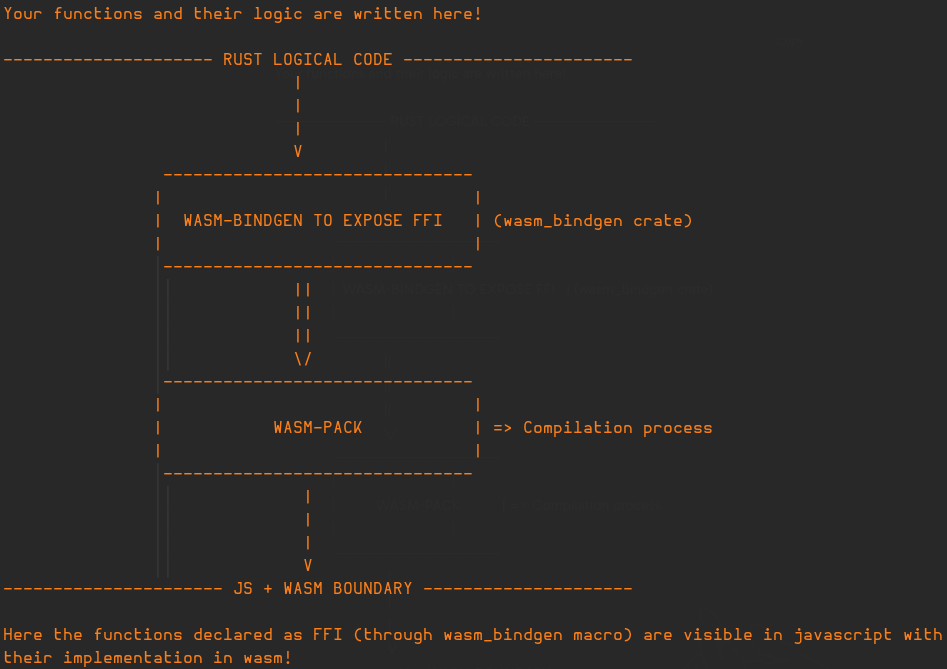
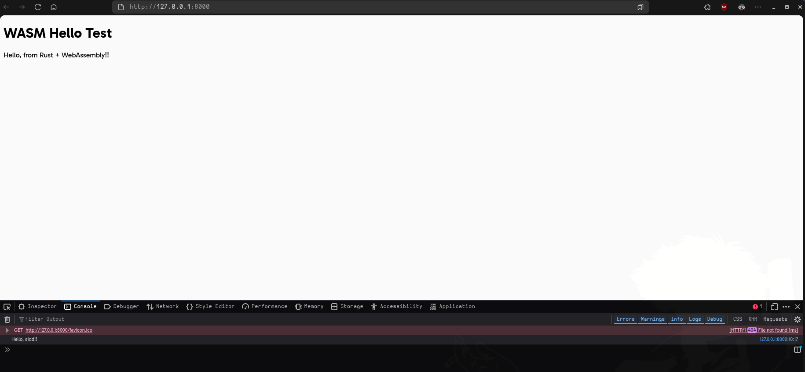

# Rust projects to Wasm

## Expectations(from you)

- A decent (beginner like) understanding of rust and some popular crates like `serde` and `rayon`

- An open and inquisitive mind

- A functioning operating system (preferably linux) with rust (rustup, rustc and cargo) along with python configured (if you want to follow along)

- A simple web browser

## Expectations (from this blog)

- Expect a learning of how to approach a problem about adding support to an existing rust project over to Wasm with currently existing tools. 

- Learn in detail about the caveats, workarounds, optimizations, performance metrics through my personal experience 

- Clear some misconceptions or give some more insight into Wasm 

- Explicit mentions to multithreading capabilities of a Wasm target

- Dwell into the javascript bindings + setting up a multithreaded environment for your Wasm target

- A lot of references to fuel your own curiousity

I added this section so that you don't read this blog with any false pretenses (and probably saves you time for when your Wasm project deadline is coming up)

---

## Preface

Personally, I had never dwelled into Wasm before extensively aside from tinkering around with `emscripten` (C++) and reading some articles on its recent popularity and adoption into many websites that demand exhaustive mathematical operations like graphical rendering or algorithm computations.

## What Wasm is not! 

I have seen many introductary articles boast or atleast talk about Wasm from a speed or performance perspective. So I wanted to add this section to clear up some prejudice about Wasm: 

- Wasm is **NOT** a means of acquiring beefy speeds on your logic in comparison to JavaScript:

This reddit page is a good starting point to understanding the truth about Wasm and its misconceptions in brief [here](https://www.reddit.com/r/webdev/comments/1ac6x3i/whats_the_point_of_wasm_and_howwhen_should_i_use/)

For a more detailed introduction to Wasm I took a look at wasmbyexample ([this](https://wasmbyexample.dev/home.en-us.html))

- Wasm is **NOT** only a target for the browser:

It is a bit of a misnomer in that sense. Wasm has significantly increased in support over Linux and other environments since its inception and can be run in:

1. Browser (obviously)
2. Server side - through [WASI](https://wasi.dev/)
3. Linux and embedded

Actually over the recent years, it has become a popular **platform-independed** alternative to bootstrap projects (like [zig](https://ziglang.org/news/goodbye-cpp/))

WASI also introduced a way for other languages to interact with Wasm with great interoperability. A lot of languages have taken advantage of this to build cool stuff, but in this blog I will particularly be talking about rust and the available tools to support a WASM target.

## Rust + Wasm

> **IMPORTANT!**
> 
> It is expected to have a decent knowledge about how a rust project template 
> looks like (especially a Wasm friendly target template)
> 
> If not, things may get a bit confusing, but I'll try my best to explain regardless
>

### Basics of Rust

Rust doesn't really require a preface, considering it become a hype train for most people to just ride (maybe with good reason but most don't dwell on this) and as rust is gaining the limelight, it has great community support that ultimately has exposed itself with Wasm in a lot of ways.

If you nevertheless, are still curious on what rust is:

1. [Rust Lang](https://www.rust-lang.org/)
2. [Rust Book](https://doc.rust-lang.org/book/)
3. [Github blog on rust](https://github.blog/developer-skills/programming-languages-and-frameworks/why-rust-is-the-most-admired-language-among-developers/)

Even a simple google search (wonder how many still do this) leads to a plethra of articles talking about it but the first 2 are the recommended way to get started with rust as a programming language. But for this blog, that really **is not** needed as rust code + comments are quite easy to understand and since I will be giving a huge context and logical reasoning before showing a snippet, you *should* not get lost in the sauce.

Anyway, Rust has a compiler called `rustc` and a toolchain multiplexer called `rustup` that manages `toolchains` and provides ways to switch, active and configure your desired `target` for compilation.

### What is a toolchain?

A “toolchain” is a complete installation of the Rust compiler (`rustc`) and related tools (like cargo). A toolchain specification includes the release channel or version, and the host platform that the toolchain runs on.

### What is a channel?

Rust is released to three different “channels”: stable, beta, and nightly.

### What is a target?

`rustc` is capable of generating code for many platforms. The “target” specifies the platform that the code will be generated for. By default, cargo and rustc use the host toolchain’s platform as the target. To build for a different target, usually the target’s standard library needs to be installed first via the rustup target command.

For more information on this, check out [rustup's concepts](https://rust-lang.github.io/rustup/concepts/index.html)

This is very convenient for a developer to choose and configure their compilation target through a certain toolchain. Logically, this is also where we start to see Wasm into the picture.

We will get into why I discussed about toolchains and what not, but first let us talk about a key component here: `wasm-pack`

### Compiling Rust to Wasm

The standard and most supported way of compiling rust to wasm is through a project called `wasm-pack` [link](https://rustwasm.github.io/wasm-pack/book/) that will deal with our core logic written in rust to be converted to Wasm code *almost hassle free*

I say almost hassle free as there are **a lot** of things that Wasm cannot do that a natively supported language (like rust) can do, but we will focus on this a bit later in the blog.

I will not be diving into a lot of specifics about the procedure of compilation here, but MDN has a good article on this [MDN article](https://developer.mozilla.org/en-US/docs/WebAssembly/Guides/Rust_to_Wasm)

### Exposing Wasm bindings to Javascript 

Upon reading the MDN article, it becomes very clear on the flow of how a rust project can add Wasm support:



This is a very interesting concept (and the process is almost magical), but we will be treating this as a black-box as this is not the topic of the blog (and things only get more heated from here)

#### What is wasm_bindgen?

In a nutshell, it is a tool that facilitates high-level interactions between Wasm modules and JavaScript, and is a part of the `rust-wasm` ecosystem, so this pairs with `wasm-pack` seamlessly.

You can read more here [wasm-bindgen guide](https://rustwasm.github.io/docs/wasm-bindgen/).

The notable features of this project includes:

- Importing JS functionality in to Rust such as DOM manipulation, console logging, or performance monitoring.

- Exporting Rust functionality to JS such as classes, functions, etc.

- Working with rich types like strings, numbers, classes, closures, and objects rather than simply u32 and floats.

- Automatically generating TypeScript bindings for Rust code being consumed by JS.

Basically, if you see this macro (`#[wasm_bindgen]`) above any function, that function along with its logic is set to be compiled over to wasm with a high level bindings exposed in javascript.

## A basic example - Tut

Here is an example of how it could look like:

### File structure

First create a basic rust project using `cargo`:

```bash 
cargo new tut
cd tut
touch index.html ## > We will need this later <
```

### Add rustup target 

```bash 
rustup target install wasm32-unknown-unknown
```

```text 
.
├── Cargo.toml
├── index.html
├── src
│   └── lib.rs
```

> [!NOTE]
> 
> We can ignore the main file here, as wasm_bindgen only cares about
> `lib.rs` as its starting point. 
> 

### lib.rs

```rust 
use wasm_bindgen::prelude::*;

/// Greet the user with a given name
#[wasm_bindgen]
pub fn greet(name: &str) -> String {
    format!("Hello, {name}!")
}
```

### Compilation

Now compile this over to wasm through `wasm-pack`:

```bash 
#!
##! NOTE: You can check for more build help using wasm-pack build --help 
wasm-pack build --target web
```

Let us take a look at the output of `wasm-pack`:

```bash 
[INFO]: 🎯  Checking for the Wasm target...
[INFO]: 🌀  Compiling to Wasm...
    Finished `release` profile [optimized] target(s) in 0.02s
[INFO]: ⬇️  Installing wasm-bindgen...
[INFO]: found wasm-opt at "/sbin/wasm-opt"
[INFO]: Optimizing wasm binaries with `wasm-opt`...
[INFO]: Optional fields missing from Cargo.toml: 'description', 'repository', and 'license'.
 These are not necessary, but recommended
[INFO]: ✨   Done in 0.33s
[INFO]: 📦   Your wasm pkg is ready to publish at /home/you/dev/wasm/tut/pkg.
```

We can see that upon compilation, it tries to find a binary called `wasm-opt`, which is something we will discuss later.

The current file structure now looks like this (ignoring all the build generated files):

```text 
.
├── Cargo.toml
├── index.html
├── pkg
│   ├── package.json
│   ├── tut_bg.wasm
│   ├── tut_bg.wasm.d.ts
│   ├── tut.d.ts
│   └── tut.js
└── src
    └── lib.rs
```

If you take a look at `tut.js`, it has the `greet` function we wrote in rust:

```js 
// ... 

/**
 * Greet the user with a given name
 * @param {string} name
 * @returns {string}
 */
export function greet(name) {
    let deferred2_0;
    let deferred2_1;
    try {
        const ptr0 = passStringToWasm0(name, wasm.__wbindgen_malloc, wasm.__wbindgen_realloc);
        const len0 = Wasm_VECTOR_LEN;
        const ret = wasm.greet(ptr0, len0);
        deferred2_0 = ret[0];
        deferred2_1 = ret[1];
        return getStringFromWasm0(ret[0], ret[1]);
    } finally {
        wasm.__wbindgen_free(deferred2_0, deferred2_1, 1);
    }
}

// ...
```

Now all we have to do is call the Wasm initializer and this function in a html or dedicated JS file!

### index.html

Here is how we can use this `greet` function in a basic HTML file:

```html 
<!DOCTYPE html>
<html>
  <head><meta charset="UTF-8"><title>Wasm greet</title></head>
  <body>
    <h1>Wasm Hello Test</h1>
    <script type="module">
      import init, { greet } from "./pkg/tut.js";

      init().then(() => {
        console.log(greet("s1dd!"));
        document.body.append(greet("from Rust + WebAssembly!"));
      });
    </script>
  </body>
</html>
```

### Serving the file 

Simply opening the HTML file in your browser will **NOT** execute the internal javascript logic, so we can launch a simple python server: 

```bash 
python -m http.server ## Change to python3 if needed
```

Now just open `http://localhost:8080` on your browser to view:



## Advancing further: Multithreading in Wasm

From this point on, I will have to assume that the reader has adequate knowledge of rust and multithreading as this is where things really get interesting and is more practical for us. We are looking for adding Wasm support to a decently big rust project, which is unlikely to be a single threaded environment.

But before we talk about how to incorporate Rust's multithreading capabilities over to Wasm, there are a few things to discuss:

### What is multithreading in Wasm?

Wasm's model allows for parallized tasks that can be utilized on top of Javascript's `Workers` system (not a fan of this personally but it works and there is no other popular alternative for the web)

I highly recommend reading [web.dev's article](https://web.dev/articles/webassembly-threads) on Wasm threads that discusses this in much more detail and covers caveats and issues pertaining to C/C++ with `emscripten`.

But in essence, the Wasm memory is represented by a `WebAssembly.Memory` object in JS. The Wasm memory object is nothing but a wrapper around the `ArrayBuffer` that only supports operations over a single thread.

As the name suggests, a `SharedArrayBuffer` (**SAB**) is an `ArrayBuffer` that can share and manipulate data (read and write) across multiple threads. Another cool feature about SAB is the that it any and all changes are seen by all threads nearly instantly (without any polling or `postMessage`)

This is ideal for our use case as it reduces idle time in computation among multiple threads, but obviously you need to ensure the usage of `Wasm atomics` (which is a simple wait and notify thread model), and ensure no race conditions occur (that is upto the user to figure out)

### Key Caveats

#### Enabling SharedArrayBuffer: Cross-Origin Isolation Policies

The history of SAB is explained quite well in [web.dev's article](https://web.dev/articles/webassembly-threads), but SAB is quite powerful and is **NOT** enabled in every website by default!

Here is [chrome's article](https://developer.chrome.com/blog/site-isolation) on **Site Isolation** and why it is necessary to maintain a `Same-Origin Policy` to avoid accessing of data between multiple websites without consent.

The history and "how" they resolve site isolation is a topic for another time, but you can read it further [here](https://web.dev/articles/coop-coep)

In a nutshell, we need our server to enable 2 HTTP headers:

```text 
Cross-Origin-Embedder-Policy: require-corp
Cross-Origin-Opener-Policy: same-origin
```

We can do this simply in python like so:

```python 
import http.server
import socketserver

PORT = 8080

class CORSHTTPRequestHandler(http.server.SimpleHTTPRequestHandler):
    def end_headers(self):
        self.send_header("Cross-Origin-Opener-Policy", "same-origin")
        self.send_header("Cross-Origin-Embedder-Policy", "require-corp")
        super().end_headers()

# Serve current directory
with socketserver.TCPServer(("", PORT), CORSHTTPRequestHandler) as httpd:
    print(f"-- Serving on http://localhost:{PORT}")
    try:
        httpd.serve_forever()
    except KeyboardInterrupt:
        print("\n> Ctrl+C detected, shutting down server.")
        httpd.shutdown()
        httpd.server_close()
        print("> Server stopped cleanly.")
```

All we have to do with our file structure is to add a `serve.py` to the root directory and use it like so:

```bash 
python serve.py ## > Will enable COOP and COEP to access SharedArrayBuffer !! <
```

The setup is quite easy, but there is a significant drawback by enabling cross origin isloation, and that is the inability to embed *most* third-party content like `iframe`, `img`, and so on.

A solution for this is to find and manage **CORS** (Cross Origin Resource Sharing), but this is very painful as far as I know. For this blog, I will not be diving into this any further, but you can look up this problem and **CORS** and **CORP** to possibly fix this.

In essence, enabling cross origin isloation is a boon to enable multithreading but a bane in many aspects. You will need to make a decision on how to pick your poison basically.

#### Wasm is a sandbox: It is very lonely 

Logically, a sandboxed environment means that it cannot access elements and concepts outside its environment. For Wasm, this is very true as it **CANNOT** access any native features like `threads` (pthreads for example), `rng`, `filesystem` and so on. This is a crucial thing to note, as it means that we need to find another way to write similar logic over to Wasm

There is no one way to do this, this is upto you and what is the ultimate goal with the task at hand; I will simply show the points of conflict that will appear in a rust project, and a solution I found to be elegant that solved the problem without removing or altering the existing code too much.

Most of the solutions will revolve around me using the conditional macro `#[cfg(target_arch = "wasm32")]` to check for the compilation target and aptly setting the code for the right target at compile time itself. We will look into this a bit later with more refined example code snippets.


#### Rust centric problems to Wasm

These problems are weird to introduce to, but some rust crates maybe just a wrapper for an existing C++ library. In this case normally we can resolve this by using the target `wasm32-unknown-emscripten`, which provides a C++ standard library in a WASM-compatible format.

But it will no longer support `wasm32-unknown-unknown`, `wasm-bindgen` and `wasm-bindgen-rayon` and our initial work will all have to be rewritten.

This is a pain to deal with and the best way out of this is to find alternative crates that do the same but completely in rust.

## Diving further: How to resolve rust code 

Now that we have covered some advance topics on Wasm and its caveats, let us dive further into providing Wasm support to actual rust code with in-depth examples.

This section is an appetizer that is much needed for diving into the **`Advance Example: jagua-rs`** section, where we apply these concepts.

Rust code resolution to Wasm depends on:

1. Identifying points of conflict (PoCs) - Could be any rust code that does not gel well with Wasm

An example of this could as simple as:

```rust 
use std::time::Instant;
```

You *can* include this in your lib.rs and it will compile, but you cannot use any features of `std::time` and expect it work 1-1 in the Wasm implementation.

2. Fixing PoCs by adding conditional macros without touching the original source code   

An example of this can be:

```rust 
#[cfg(not(target_arch = "wasm32"))]
use std::time::Instant;
```

When compiling to Wasm, we can simply just add conditional macro that compiles according to the compilation target. Macros are a great way of doing that (in C/C++ as well) without having to remove or refactoring the original source.

3. Migrating certain tasks over to javascript 

File I/O is something that Wasm absolutely cannot do under any circumstances as it is a **sandboxed environment** with no access to the native operating system's filesystem. So using the standard library of rust to fetch the contents of a file is pointless in rust and there is no "workaround" here.

Instead, we leave the file I/O to javascript's `fetch` for example (this is quite broad as this is a HTTP request that works on a filesystem as well) and other ways to handle read and write to HTML+JS.

In rust, just take the file input as a parameter like so:

> **Minimal Example of reading any file from JS and reading it in rust code:** 

```rust 
use wasm_bindgen::prelude::*;
use web_sys::console;

#[wasm_bindgen]
pub fn process_file_bytes(buffer: &[u8]) -> Result<(), JsValue> {
    console_error_panic_hook::set_once();

    // Log length
    console::log_1(&JsValue::from_str(&format!(
        "[Rust] Received {} bytes", buffer.len()
    )));

    // (Optional) If you want to try parsing as UTF-8 text
    if let Ok(text) = std::str::from_utf8(buffer) {
        console::log_1(&JsValue::from_str(&format!(
            "[Rust] UTF-8 content: {}...", &text.chars().take(100).collect::<String>()
        )));
    } else {
        console::log_1(&JsValue::from_str("[Rust] Content is not valid UTF-8"));
    }

    Ok(())
}
```

In HTML+JS:

```html 
<!DOCTYPE html>
<html lang="en">
<head>
  <meta charset="UTF-8" />
  <title>Generic File Upload to WASM</title>
</head>
<body>
  <h2>Select any file to send to Rust:</h2>
  <input type="file" id="fileInput" />
  <pre id="log"></pre>

  <script type="module">
    import init, { process_file_bytes } from "./pkg/your_project.js";

    const log = document.getElementById("log");

    async function main() {
      await init();
      console.log("[JS] WASM loaded.");

      const fileInput = document.getElementById("fileInput");
      fileInput.addEventListener("change", async (event) => {
        const file = event.target.files[0];
        if (!file) return;

        const arrayBuffer = await file.arrayBuffer();
        const uint8 = new Uint8Array(arrayBuffer);

        log.textContent = `[JS] Read ${uint8.length} bytes from file: ${file.name}`;
        console.log("[JS] Sending to Rust...");

        try {
          process_file_bytes(uint8);
        } catch (err) {
          console.error("[JS] Error from Rust:", err);
        }
      });
    }

    main();
  </script>
</body>
</html>
```

Here, `JsValue` is just the representation of an object owned by JS. You can read more about it here [JsValue rs docs](https://rustwasm.github.io/wasm-bindgen/api/wasm_bindgen/struct.JsValue.html) and [Using JsValue](https://rustwasm.github.io/wasm-bindgen/reference/types/jsvalue.html)

4. Understand basics of `wasm-bindgen-rayon` for parallized computations 

This crate is so easy to use I wonder if it actually works or is it just a placebo effect (but jokes aside I have seen a great improvement in high computational iterations leading to better performance)

You can read up more about wasm-bindgen-rayon here: [wasm-bindgen-rayon GitHub](https://github.com/RReverser/wasm-bindgen-rayon) and [docs](https://docs.rs/wasm-bindgen-rayon/latest/wasm_bindgen_rayon/)

However, this is a double edged sword in a lot of cases, as this crate only supports the `web` target only! (nodejs, bundler, etc. are **NOT**!!)

The reason for this is quite simple and not really the crate's fault: Wasm code creates a `WebAssembly.Module` object and needs to share it to other threads during initialization of thread pool. This object by design is only accessible in `--target web` and `--target no-modules`.

Furthermore, since `wasm-bindgen-rayon` is using [JS Snippets](https://rustwasm.github.io/wasm-bindgen/reference/js-snippets.html), this crate only supports `web`. This might be a huge set back for a lot people who want to make it more modular for *any* target like `nodejs`, `deno`, and so on

> [!NOTE]
> 
> You can check all possible build targets of `wasm-pack` using: 
> 
> ```bash 
> wasm-pack build --help # look at --target
> ```
> 

Despite how easy this was to use, there was a key patch I had to make with this crate in particular which is why I have added this section (I will talk about this in the advanced example in detail)

5. Finding possible optimizations

This is important if you need your Wasm code performance to be nearly as good as the native counterpart. Now this is quite a vague topic as finding optimizations is not a simple thing; it can be incredibly circumstantial and I possibly cannot cover this vast topic in this blog. So I will give my experience on how my approach to optimize the Wasm code was, with possible numbers on how well it performed in the future.

This covers all topics that are needed to get started on a more advanced example.

---

## Advanced Example: `jagua-rs`

### Preface

[jagua-rs](https://github.com/JeroenGar/jagua-rs) is a fast CDE (collision detection engine) for 2D irregular cutting and packing problems like BPP (Bin Packing) and SPP (Strip Packing) and is designed to be a backend for optimization algorithms solving these packing problems.

[lbf](https://github.com/JeroenGar/jagua-rs/blob/main/lbf) is a reference implementation of an optimization algorithm built on top of `jagua-rs`. 

We will be making changes to this in particular as we want to add lbf implementation over to Wasm.

### Problem statement

Add Wasm support to LBF without removing it's original code, and handle `jagua-rs`'s multithreading capabilities through `wasm-bindgen-rayon`. Create a simple frontend for users to select the problem they want to solve, the input (in JSON) and the config for `jagua-rs` (in JSON).

> **NOTE:**
> 
> We will be following commit hash **bbc65a5** (as of 06/07/2025)
> 
> I will discuss a issues I had with `jagua-rs` in past commits that have 
> been resolved now as well.
> 

### Solution

I will be giving the main things I resolved and how I did them, the tips and tricks along with references I have provided so far should help you understand why these were necessary.

Here is my fork of jagua-rs with support for Wasm: [wasm-parallel branch of jagua-rs](https://github.com/nots1dd/jagua-rs/tree/wasm-parallel)

This fork has a [DEV.md](https://github.com/nots1dd/jagua-rs/blob/wasm-parallel/DEV.md) which has a deep dive into all the changes made to the project and why.

### Rust Code Resolutions

Below are the major code resolutions made to `jagua-rs` and `lbf` crates **ONLY**!

1. New Dependencies

The following dependencies were added to support the WASM runtime and multithreaded execution:

In the root `Cargo.toml`:

```toml
wasm-bindgen = { version = "0.2", features = ["serde"] }
web-sys = { version = "0.3", features = ["Window", "Performance"] }
serde-wasm-bindgen = "0.6"
wasm-bindgen-rayon = { version = "1.3", features = ["no-bundler"] }
console_error_panic_hook = "0.1"
```

For **web** target the `no-bundler` feature is required!!

If you are not using the `no-bundler` feature, then run this with the build script:

```bash 
./build-wasm.sh --target web --patch-rayon # this will patch the dynamic import that bundlers use (web cant resolve this)
```

Additionally, the `getrandom` crate was added explicitly with WASM support enabled:

```toml
getrandom = { version = "0.3", default-features = false, features = ["wasm_js"] }
```

We should also ensure that both `jagua-rs` and `lbf`'s `Cargo.toml` files have this:

```toml 
getrandom = { workspace = true }


# Only compile these when targeting wasm32
[target.'cfg(target_arch = "wasm32")'.dependencies]
wasm-bindgen = { workspace = true }
wasm-bindgen-rayon = { workspace = true }
serde-wasm-bindgen = { workspace = true }
console_error_panic_hook = { workspace = true }
console_log = { version = "1.0", features = ["color"] }
web-sys = { workspace = true }
```

This avoids runtime errors with crates like `rand` that rely on `getrandom` under the hood.

> See: [getrandom WebAssembly support](https://docs.rs/getrandom/0.3.3/#webassembly-support)

Finally, we need to create a `.cargo/config.toml` in the `lbf` directory:

```toml 
[target.wasm32-unknown-unknown]
rustflags = [
  "--cfg", "getrandom_backend=\"wasm_js\"",
  "-C", "target-feature=+atomics,+bulk-memory,+simd128",
]

[unstable]
build-std = ["panic_abort", "std"]
```

This config lets cargo know the following:

a. Set the `getrandom` backend for support for `wasm_js` when compiling to `wasm32-unknown-unknown` target 
b. Set target features of atomics + bulk-memory + simd128 on when compiling to `wasm32-unknown-unknown` target (needed for multithreading)
c. To rebuild the standard library for point b (for threading in Wasm)

Point 'c' is necessary as the Rust standard library for the WebAssembly target is built without threads support to ensure maximum portability.

Since we want standard library to be thread-safe and `std::sync` APIs to work, you'll need to use the nightly compiler toolchain and pass some flags to rebuild the standard library in addition to our code.

2. WASM-Specific Compatibility Changes

#### 2.1 Accounting for `std::time::Instant`

Because `std::time::Instant` is not portable to WASM (especially in browser environments), we needed a simple modular way to handle timestamps for both native and Wasm counterparts.

This is why I added a extra file [time.rs](https://github.com/nots1dd/jagua-rs/blob/wasm-parallel/lbf/src/time.rs) in `lbf/src`

This Rust file defines a cross-platform time abstraction called TimeStamp, designed to work both in:

- Native environments (like Linux/macOS/Windows)
- Wasm environments (e.g., in the browser via wasm32)

You can check out the implementation for it, it is quite simple; it provides a `TimeStamp` enum with a lot of methods that have internal logic depending on the `target_arch`. Here is a small snippet:

```rust 
/// Get a new timestamp for "now"
pub fn now() -> Self {
    #[cfg(not(target_arch = "wasm32"))]
    {
        /// This is std::time::Instant --> NOT Wasm COMPATIBLE!!
        TimeStamp::Instant(Instant::now())
    }

    #[cfg(target_arch = "wasm32")]
    {
        /// Custom function that uses web_sys's performance() --> Wasm COMPATIBLE!!
        TimeStamp::Millis(now_millis())
    }
}
```

Now, we replace all instances of using `std::time::Instant` with: 

```rust 
Instant::now(); // OLD

/// This internally deals with whether the target_arch is wasm or not!
TimeStamp::now() // NEW
```

### 2.2 BPProblem and SPProblem API Changes

A small but essential change was made to the `BPProblem::save()` and `SPProblem::save()` API (for Wasm only):

```rust
// Previous:
self.problem.save() // only works in native

// New:
let time = now_millis(); // platform-specific time in f64
#[cfg(target_arch = "wasm32")]
self.problem.save(time); // Wasm friendly save function
#[cfg(not(target_arch = "wasm32"))]
self.problem.save() // native save function

// Can also use:

let time = TimeStamp::now();
#[cfg(target_arch = "wasm32")]
self.problem.save(time.elapsed_ms());
```

This preserves time metadata without relying on non-WASM-compatible structures.

### 2.3 Other Changes

* Logic was added to safely convert `f64` timestamps to `u64` when needed.
* `BPSolution` and `SPSolution` have Wasm32 specific structs now for the `time_stamp` param.
* Added a logger for Wasm + native in [lib.rs](https://github.com/nots1dd/jagua-rs/blob/wasm-parallel/lbf/src/lib.rs)
* Modified the current [init_logger](https://github.com/nots1dd/jagua-rs/blob/wasm-parallel/lbf/src/io/mod.rs)
* Rng fallback was modified (in config's prng_seed) for Wasm:

```rust 
SmallRng::from_os_rng(); // Native solution: not Wasm compatible

// A more determisnistic fallback for rng seed (only invoked if config does not have prng_seed
SmallRng::seed_from_u64(0x12345678); // Wasm friendly solution
```

> [!WARNING]
> 
> The 3rd point is deprecated and this crate is no longer used in the 
> latest commit of jagua-rs, but I have still kept this to showcase the workaround 
> I came up at the time.
> 

## 3. The `separation-distance` Feature

This feature was disabled due to its reliance on non-Rust dependencies that are incompatible with `wasm32-unknown-unknown`.

### 3.1 Why It Was Disabled

The feature uses geometric operations to ensure polygons maintain a certain minimum separation. However, its dependency stack introduces compatibility issues.

### 3.2 Dependencies and Their Issues

From `Cargo.toml`:

```toml
geo-offset = { version = "0.4.0", optional = true }
geo-types = { version = "0.7.16", optional = true }
```

`geo-offset` internally depends on `geo-clipper`, which in turn depends on `clipper-sys`, a Rust FFI wrapper for the C++ `Clipper` library.

### 3.3 Compiling C++ to WASM: Why It's Problematic

C++ code can only be compiled to WASM using **Emscripten**, which provides a C++ standard library in a WASM-compatible format. However:

* This cannot be used with the `wasm32-unknown-unknown` target.
* `wasm-bindgen` and `wasm-bindgen-rayon` are not compatible with Emscripten.
* Threading, memory sharing, and JS bindings would all need to be rewritten.

### 3.4 Why Emscripten Was Rejected

Using `wasm32-unknown-emscripten` would:

* Break `wasm-bindgen`-based integration.
* Prevent usage of `wasm-bindgen-rayon`.
* Require maintaining a dual toolchain and completely different build and integration workflow.

These trade-offs were deemed too costly for minimal functional gain.

### 3.5 Resolution

The preferred solution is to switch to a **pure Rust** alternative for polygon offsetting.

#### Suggested Alternative:

* [`geo + geo-buffer`](https://crates.io/crates/geo) – performs geometric boolean operations and is compatible with `wasm32-unknown-unknown`.

This issue has since been resolved by jagua-rs maintainer in this [commit](https://github.com/JeroenGar/jagua-rs/pull/38). I have put this here regardless to showcase how I approached the problem and the modifications I had to make at the time (you *may* come across issues like this too)

For more small changes you can check out the fork yourself and compare the diff between `jagua-rs` and `wasm-parallel`. Most of the important ones are covered here and DEV.md!

To see how easy it is made to compile to Wasm without destroying the original code:

```bash 
# in the project root

## This is the native version
cargo run --release --bin lbf -- -c assets/config_lbf.json -i assets/baldacci1.json -p bpp -s output

## This is for Wasm 
./build-wasm.sh --target web --opt O4
## To view it in the web 
python serve.py
```

Now you can view it in in your browser by entering the url `http://localhost:8081` (tip: view the console logs for a detailed logs on the algorithm)

The build script has a lot of abstraction that needs to talked about, as it compiles, optimizes and wraps it all conveniently.

We will discuss more about the build script and its interior in the next section.

### Build script to Wasm

The script itself is quite simple and won't be going in depth about how bash and scripting works. You have the internet at your disposal for that. But what is the crux of the script is divided into 2 aspects:

1. Compiling the `lbf` project to Wasm through `wasm-pack`:

```bash 
# ..
"$WASM_PACK" build --target "$TARGET" --release
# ..
```

There is not a lot to explain here we have setup all the dependencies and configurations required (in `lbf/.config/cargo.toml`, `rust-toolchain.toml`) for the proper compilation of the code to `wasm32`. `wasm-pack` is detected in the user's OS and compiles this to a release build.

The output of this build will be present in `lbf/pkg/` where you can see:

```text 
lbf/pkg
├── lbf_bg.wasm        --> IMPORTANT: Our code is compiled to Wasm here!
├── lbf_bg.wasm.d.ts
├── lbf.d.ts
├── lbf.js             --> IMPORTANT: Our bindings for functions are accessible here!
├── package.json
├── README.md
└── snippets           --> IMPORTANT: wasm-bindgen-rayon crate creates this worker for multithreading!
    └── wasm-bindgen-rayon-38edf6e439f6d70d
        └── src
            └── workerHelpers.no-bundler.js 
```

2. Using `wasm-opt` for further optimizations to `lbf_bg.wasm`:

Binaryen offers a CLI tool called `wasm-opt` which is very great to optimize the size or performance of a given Wasm file. 

```bash 
# ....
WASM_OPT_ARGS="$WASM_OPT_LEVEL --dce --enable-simd --enable-bulk-memory --enable-threads -ifwl -ffm --memory-packing --enable-gc"
# ....

# Run wasm-opt
wasm-opt $WASM_OPT_ARGS -o "$OUT_FILE" "$WASM_PATH"
```

The one argument I found to be very helpful in this context (as we are using `f64` for timestamps) is `-ffm` which is short for **fast math**: it optimizes floats which is crucial for us and has shown to be impactful in terms of performance.

The arguments I am sending to `wasm-opt` are self-explanatory and as such I wont waste your time here. If you want to see more arguments and what they do just run:

```bash 
wasm-opt -h
```

And that sort of concludes the advanced example. If your code has a lot of `rayon` parallel iterators, then using `wasm-bindgen-rayon` should automatically setup web workers that will obey the original iterator code block without a hitch.

## Looking ahead: Further performance?

As we are greedy beings, we want a sandboxed environment with limited exposure to threading to perform on par with a fully decked out native language that has an entire operating system at its disposal. So the question begs us "How can we make this better?"

Frankly it is a question that even I am trying to find a concrete answer to. Using `wasm-opt` only gets you so far as it is not tailor made for your code but rather the code generated by the compiler. It **will not** solve your logical flaws (which is quite obvious).

### Statically allocating memory at compile time?

From the articles I read, Wasm seems to perform relatively poorly with dynamic memory allocation. So using something like 100s of vectors which are dynamically allocated on the heap versus a `heapless vector` (heapless crate) should have a noticeable difference but I did not find that to be the case with a closed source project I was working on (that is closely related to this).

Another way to avoid minimize dynamic memory usage is to use stack or custom allocators like **[bump allocators](https://rust-hosted-langs.github.io/book/chapter-simple-bump.html)** (more about it in the link) but in a nutshell, any form of a custom allocating algorithm that tries to stay independent of `malloc` or `free` (any dyn-mem function) will *naturally lead* to faster execution times.

But this is still kind of a black box to me and I do not fully understand it. I have tried this before by using `bumpalo` crate in Rust but found very minimal and unreliable performance bump-up (pun unintended).

### JIT Compiler Warmup?

Here is really nice blogs I read on WebAssembly performance here: [surma.dev's article](https://surma.dev/things/js-to-asc/) and [medium article](https://medium.com/%40krishna.dhend22/webassembly-and-compiler-design-enabling-efficient-code-execution-in-modern-browsers-d0aa0f585367) that talk about **`JIT Warmup`**, a result of the **tiered compilation** architecture of JS engines like`v8` (Chrome) and `SpiderMonkey` (Firefox)

`JIT Warmup` is very useful as it allows for recompilations to be *much* faster than the initial one. The hybrid compilation model is like so:

- Liftoff (Baseline Compiler): Quickly compiles code at load time for fast startup.
- TurboFan (Optimizing Compiler): Recompiles “hot” functions in the background with aggressive optimizations.

This warmup is very noticeable for JavaScript and not Wasm really, but as your frontend logic and functional bindings are exported to JS, this is still very important to keep in mind.

Also here is a cool article I found about the JavaScript engine and the tradeoffs it performs to execute JS as fast as modern browsers do [here](https://mathiasbynens.be/notes/prototypes#tradeoffs)

## Conclusion

We can go on and on and spew keywords that *may* improve your Wasm output's performance like `batch processing`, `LTO`, `SIMD` so on but with lack of information this is just useless and you don't need this blog to further understand these topics (these can be topics for the future however, as I keep learning more about it). 

That being said, I believe there 2 major **expensive** concepts when it comes to a Wasm execution pipeline:

1. Dynamic memory allocation 
2. JS <-> Wasm boundaries

Finding a way to resolve these *should* theoretically help with performance. But as it is right now, this is just logical speculation from my end.

So I recommend just experimenting and tinkering around with the code and diagnose its execution flow; run `flamegraph` on it and check which function is taking the most time and figure out why that is. If you cannot come up with an explanation for it, try to search online or use LLMs to see if there are any possible explanations, and if all else fails move on and find other possible weak points in your algorithm and see which one sticks out until you exhaust of all possible ideas.

It is quite a lame advice but that is how I have found many optimization techniques myself and I am still only a beginner in this topic.

Coming out of the performance mayhem, hope this blog gained your interest for more than 10 mins or so. I tried to cover as much as I could without boring details and rephrasing the same words most popular blogs would already have on this matter. The goal was always to give a roadmap and potholes to look for, and not a crash course to ace a test. If I did somehow manage to hold your interest till this point, I take it as a personal dub and so should you.

You can further check out the actual source code [here](https://github.com/nots1dd/jagua-rs/tree/wasm-parallel) that has the complete implementation of adding Wasm support for `jagua-rs`.
